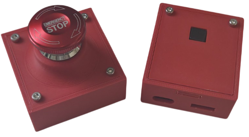

# 🚨 Wireless E-Stop

A reliable **wireless emergency stop system** using nRF24L01+ modules and Arduino-compatible microcontrollers, developed by the *Inria Paris Robotics Lab*.  
This system is designed for robots, machines, or any setup that needs a secure and fast wireless emergency stop.

## Project Overview

<table>
<tr>
<td>

This project implements a **wireless safety system** with the following key features:

- Secure wireless link using **nRF24L01+**
- Configurable RF channel to avoid interferences
- "Leaky bucket" timeout algorithm to detect signal loss
- Compact payload for fast transmission
</td>
<td align="right">

</td>
</tr>
</table>

## Hardware Requirements

- 2x [Arduino-compatible microcontrollers](https://www.amazon.fr/d%C3%A9veloppement-microcontr%C3%B4leur-AYWHP-Microcontr%C3%B4leur-Compatible/dp/B0DFGX3MSL/ref=sr_1_8?__mk_fr_FR=%C3%85M%C3%85%C5%BD%C3%95%C3%91&crid=4G89TNJAHVZQ&dib=eyJ2IjoiMSJ9.FX0IhFGlTdJJ3gpWeDmP9npOORZucw0aNMP1ylbj2NlMUe0cnJGUNVQjB6oYB2ilD2WHrZWg-abriT85E8qTFV_-IpRj9sAs7UYABbsYjl_X7nq8r2LN27xlIFMNj1j3GittSrMWich4pvgsucpMhc6bvYpwPaA5FSDjHMlNXXnf4vsN3o3Es5FoyUINxe_ZF5eDpxAQpOeVmTWD2RqeToeuUGUPymbp8n8FnsJlkRIIt4i610PmIGO2jw2UMsGL498j_OKdcKvtYy07lKUhxfBtVbEc21rP91mDa1Edwyg.plcleKJa5wVy7K-UAAY0uCWQ2WhBGNK3m7qGQjfImzs&dib_tag=se&keywords=arduino+nano&qid=1759930728&sprefix=arduino+nano%2Caps%2C63&sr=8-8) (e.g., Nano, Uno)
- 2x [nRF24L01+ RF modules](https://www.amazon.fr/gp/product/B06XJN417D/ref=ox_sc_act_title_3?smid=A1X7QLRQH87QA3&psc=1)
- 1x [Relay module]( https://www.amazon.fr/gp/product/B08CDQ6CF8/ref=ox_sc_act_title_1?smid=A21312XZUBAZON&psc=1) (3.3V or 5V just make sure the relay voltage matches your microcontroller logic level)
- 1x [Emergency stop button](https://www.amazon.fr/gp/product/B08ZS8HZYV/ref=ox_sc_act_title_4?smid=A1DBC97EH2O973&th=1)
- 1x [Reset button](https://www.amazon.fr/RUNCCI-YUN-momentan%C3%A9-tactile-Interrupteur-capuchon/dp/B0BF51N8CK/ref=sr_1_8?dib=eyJ2IjoiMSJ9.dVl_MeD5IAG7w1xUoVmBYmz7jDtAWZJCTvqCe43uAAnatBawtf4C7pW9aKYYx61GDhyU1arW2Komuh5MvcT2XgWiGtiboadEU94IyNGqYzszyCV-5b9XrpFoTZru-WZpvlMDUq4vsVN6tzbkK1EfKkq2RcBbYeOIaBfENTVXURsC0K594bwUbJs_av9Yi9bgtdXGuQ5md6e2mmcGnWbpNJIAqS18aPxhHyZNSb0pzN8lAjFu7W30KURADSAmXrUJEtWVr3b6mOY3KI50JthCgOn9yIL6esnGOb1nl_7YyxM.8kEw3WviFi7g5cpKaVjNrNf7XcfvS1JtKz9xLuanh40&dib_tag=se&keywords=bouton+arduino&qid=1759930568&sr=8-8) (for receiver)
- 10x M3 screws (for case assembly)
- 3D [printed cases](./hardware/CAD)

## Pin Connections

| **Arduino Pin**| **Transmitter**                  | **Receiver**                             |
|----------------|----------------------------------|------------------------------------------|
| **VCC**        | 3.3V nRF24L01                    | 3.3V nRF24L01 and Relay Module           |
| **GND**        | GND nRF24L01, E-stop Button      | GND nRF24L01, Relay Module, Reset Button |
| **D2**         | E-stop Button                    | Reset Button                             |
| **D5**         | ——————————————                   | Relay IN Pin                             |
| **D9**         | nRF24L01 CE                      | nRF24L01 CE                              |
| **D10**        | nRF24L01 CSN                     | nRF24L01 CSN                             |
| **D11**        | nRF24L01 SPI (MOSI)              | nRF24L01 SPI (MOSI)                      |
| **D12**        | nRF24L01 SPI (MISO)              | nRF24L01 SPI (MISO)                      |
| **D13**        | nRF24L01 SPI (SCK)               | nRF24L01 SPI (SCK)                       |

## Software Overview

### Transmitter (`transmitter.ino`)

- Reads the state of the emergency stop button
- Sends a **boolean message** over RF every 100ms
- Allows RF channel configuration at boot by holding the button and using the Serial Monitor

### Receiver (`receiver.ino`)

- Listens for messages from the transmitter
- Uses a "leaky bucket" algorithm to detect communication loss
- Activates the **relay** (opens the circuit) if:
  - A message is received with `true`, or
  - No messages received for a set period
- Requires a **3-second button press** to rearm system

## RF Channel Configuration

Both transmitter and receiver support **on-boot channel setup**:

1. **Hold the button** during power-up (E-stop button for transmitter, Reset button for receiver)
2. Open the Serial Monitor at **115200 baud**
3. Enter a new channel (0–125)
4. Release the button to finish setup

> Tip: Use a **high channel number** (>100) to avoid interference with WiFi.

## Dependencies

Install via Arduino Library Manager:

- [`RF24`](https://github.com/nRF24/RF24)
- `EEPROM` and `SPI` (built-in)

## Hardware Files

CAD and electronic schematics are located in the [`hardware/`](./hardware) folder.

Contents may include:

- Electronic schematics 
- 3D printable case FreeCAD files and STL exports

