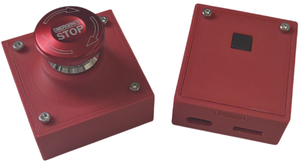

# 🚨 Wireless E-Stop

A reliable **wireless emergency stop system** using nRF24L01+ modules and Arduino-compatible microcontrollers, developed by the *Inria Paris Robotics Lab*.
This system is designed for robots, machines, or any setup that needs a secure and fast wireless emergency stop.

## Project Overview

<table>
<tr>
<td>

This project implements a **wireless safety system** with the following key features:

- Secure wireless link using **nRF24L01+**
- Configurable RF channel to avoid interferences
- "Leaky bucket" timeout algorithm to detect signal loss
- Compact payload for fast transmission
</td>
<td align="right">

</td>
</tr>
</table>

## Hardware Requirements

### Bill of Materials (BOM) for 1 Pair

| Qty | Item | Unit Cost (€) | Notes |
|------|------|------:|------|
| 2 | [Arduino Nano + nRF24L01+ RF module](https://fr.aliexpress.com/item/1005006939062836.html) | 2.00 | One for transmitter, one for receiver |
| 1 | [Relay module](https://www.amazon.fr/gp/product/B08CDQ6CF8/) | 7.00 | 3.3V or 5V, matching MCU logic level |
| 1 | [Emergency stop button](https://www.amazon.fr/gp/product/B08ZS8HZYV/) | 14.00 | Main emergency stop |
| 1 | [Reset button](https://www.amazon.fr/mini-boutons-poussoirs-tactiles-%C3%A9lectroniques-domotiques/dp/B0F5VCJY95/) | 0.10 | Receiver reset button |
| 1 | [WS2812B LED](https://www.amazon.fr/Tesfish-Adressable-Individuellement-Intelligente-D%C3%A9coration/dp/B0D5B7HDPP/) | 0.10 | Status indication |
| 10 | M3 screws | - | Case assembly |
| 1 set | [3D printed cases](./hardware/CAD) | 2.00 | Transmitter + receiver enclosure |
| **Total** | **27.20 €** |

## Pin Connections

| **Arduino Pin**| **Transmitter**                  | **Receiver**                             |
|----------------|----------------------------------|------------------------------------------|
| **VCC**        | 3.3V nRF24L01                    | 3.3V nRF24L01 and Relay Module           |
| **GND**        | GND nRF24L01, E-stop Button      | GND nRF24L01, Relay Module, Reset Button |
| **D2**         | E-stop Button                    | Reset Button                             |
| **D5**         | ——————————————                   | Relay IN Pin                             |
| **D9**         | nRF24L01 CE                      | nRF24L01 CE                              |
| **D10**        | nRF24L01 CSN                     | nRF24L01 CSN                             |
| **D11**        | nRF24L01 SPI (MOSI)              | nRF24L01 SPI (MOSI)                      |
| **D12**        | nRF24L01 SPI (MISO)              | nRF24L01 SPI (MISO)                      |
| **D13**        | nRF24L01 SPI (SCK)               | nRF24L01 SPI (SCK)                       |

## Software Overview

### Transmitter (`transmitter.ino`)

- Reads the state of the emergency stop button
- Sends a **boolean message** over RF every 100ms
- Allows RF channel configuration at boot by holding the button and using the Serial Monitor

### Receiver (`receiver.ino`)

- Listens for messages from the transmitter
- Uses a "leaky bucket" algorithm to detect communication loss
- Activates the **relay** (opens the circuit) if:
  - A message is received with `true`, or
  - No messages received for a set period
- Requires a **3-second button press** to rearm system

## RF Channel Configuration

Both transmitter and receiver support **on-boot channel setup**:

1. **Hold the button** during power-up (E-stop button for transmitter, Reset button for receiver)
2. Open the Serial Monitor at **115200 baud**
3. Enter a new channel (0–125)
4. Release the button to finish setup

> Tip: Use a **high channel number** (>100) to avoid interference with WiFi.

## Dependencies

Install via Arduino Library Manager:

- [`RF24`](https://github.com/nRF24/RF24)
- `EEPROM` and `SPI` (built-in)

## Hardware Files

CAD and electronic schematics are located in the [`hardware/`](./hardware) folder.

Contents may include:

- Electronic schematics
- 3D printable case FreeCAD files and STL exports
