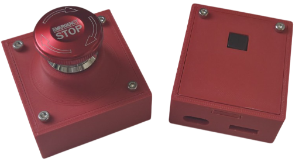

# 🚨 Wireless E-Stop

A reliable **wireless emergency stop system** using nRF24L01+ modules and Arduino-compatible microcontrollers, developed by the *Inria Paris Robotics Lab*.
This system is designed for robots, machines, or any setup that needs a secure and fast wireless emergency stop.

## Project Overview

<table>
<tr>
<td>

This project implements a **wireless safety system** with the following key features:

- Secure wireless link using **nRF24L01+**
- Configurable RF channel to avoid interferences
- "Leaky bucket" timeout algorithm to detect signal loss
- Compact payload for fast transmission
</td>
<td align="right">

</td>
</tr>
</table>

## Hardware Requirements

- 2x [Arduino-Nano NRF24L01+ microcontrollers](https://fr.aliexpress.com/item/1005006939062836.html)
- 1x [Relay module]( https://www.amazon.fr/gp/product/B08CDQ6CF8/ref=ox_sc_act_title_1?smid=A21312XZUBAZON&psc=1) (3.3V or 5V just make sure the relay voltage matches your microcontroller logic level)
- 1x [Emergency stop button](https://www.amazon.fr/gp/product/B08ZS8HZYV/ref=ox_sc_act_title_4?smid=A1DBC97EH2O973&th=1)
- 1x [Reset button](https://amazon.fr/dp/B0BF51N8CK) (for receiver)
- 1x [Signal LED (WSG2812B)](https://amazon.fr/dp/B0D5B7HDPP) (for receiver)
- 20x M3 screws
- 4x M1.6 screws
- 3D [printed cases](./hardware/CAD)

## Pin Connections

| **Arduino Pin**| **Transmitter**                    | **Receiver**                               |
|----------------|------------------------------------|--------------------------------------------|
| **3.3V**       | ——————————————                     | Relay Module                               |
| **GND**        | GND, E-stop Button                 | GND, Relay Module, Signal LED, Reset Button|
| **5.5V**       | ——————————————                     | Signal LED                                 |
| **D5**         | ——————————————                     | Relay IN Pin                               |
| **D9**         | used for nRF24L01 CE               | used for nRF24L01 CE                       |
| **D10**        | used for nRF24L01 CSN              | used fornRF24L01 CSN                       |

## Software Overview

### Transmitter (`transmitter.ino`)

- Reads the state of the emergency stop button
- Sends a **boolean message** over RF every 100ms
- Allows RF channel configuration at boot by holding the button and using the Serial Monitor

### Receiver (`receiver.ino`)

- Listens for messages from the transmitter
- Uses a "leaky bucket" algorithm to detect communication loss
- Activates the **relay** (opens the circuit) if:
  - A message is received with `true`, or
  - No messages received for a set period
- Requires a **3-second button press** to rearm system

## RF Channel Configuration

Both transmitter and receiver support **on-boot channel setup**:

1. **Hold the button** during power-up (E-stop button for transmitter, Reset button for receiver)
2. Open the Serial Monitor at **115200 baud**
3. Enter a new channel (0–125)
4. Release the button to finish setup

> Tip: Use a **high channel number** (>100) to avoid interference with WiFi.

## Dependencies

Install via Arduino Library Manager:

- [`RF24`](https://github.com/nRF24/RF24)
- `EEPROM` and `SPI` (built-in)

## Hardware Files

CAD and electronic schematics are located in the [`hardware/`](./hardware) folder.

Contents may include:

- Electronic schematics
- 3D printable case FreeCAD files and STL exports

## Additional tutorials for specific robots
Some robots like Unitree do not have external emergency connectors and require additional work to implement the e-stop. You can find tutorials for certains robots in the [robot-specific-tutorials](/robot-specific-tutorials/) folder.