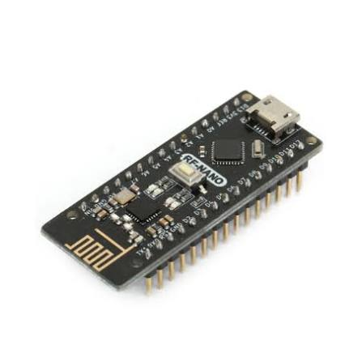
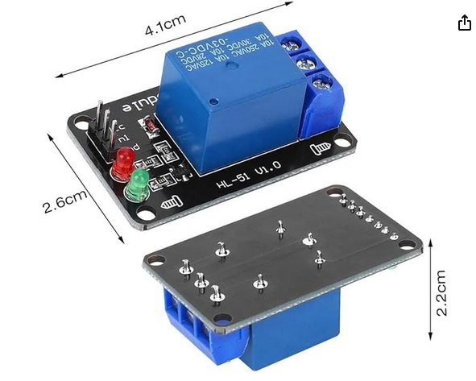
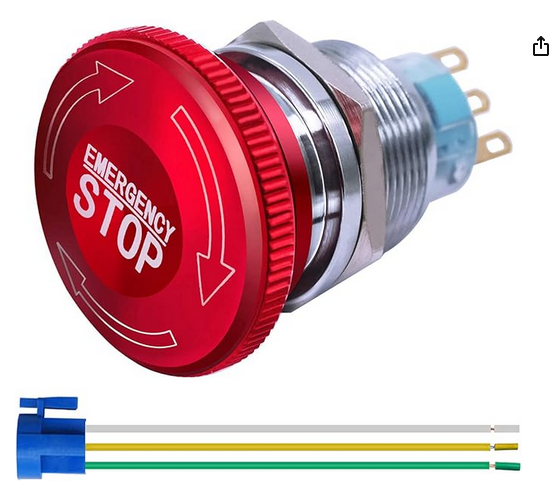
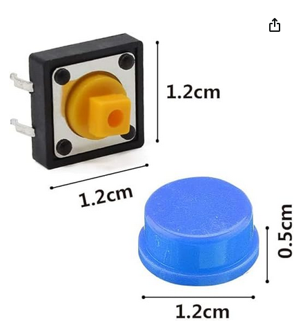
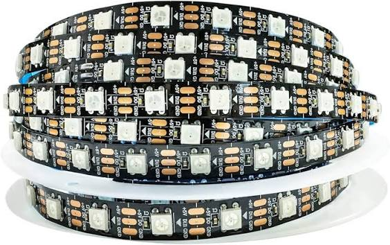

# Hardware Components Reference

Below are screenshots of Amazon listings for each hardware component used in this project. This ensures reference information is retained even if product links change or are deleted.

## 1. Arduino Nano nRF24L01+

## 2. Relay module

## 3. Emergency stop button

## 4. Reset button

## 5. Signal LED

