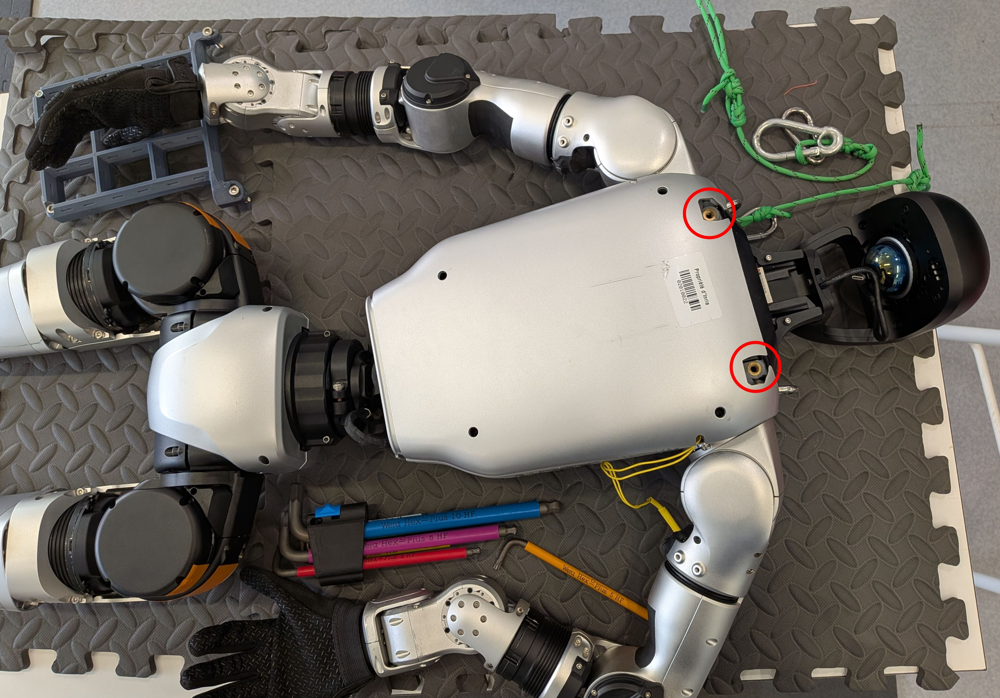
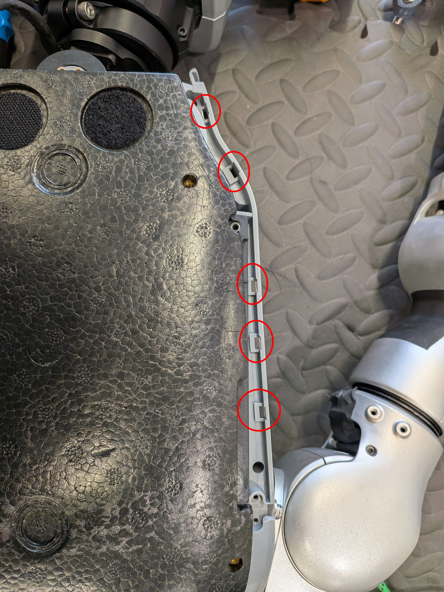
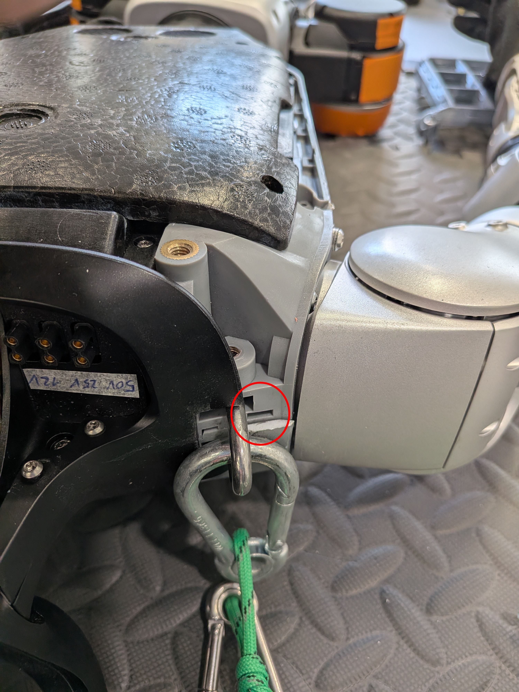
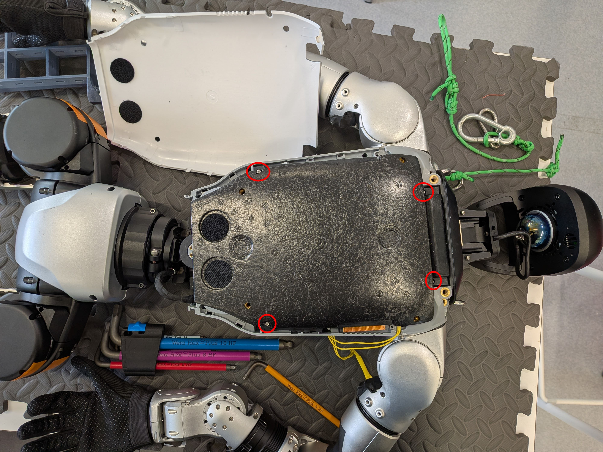
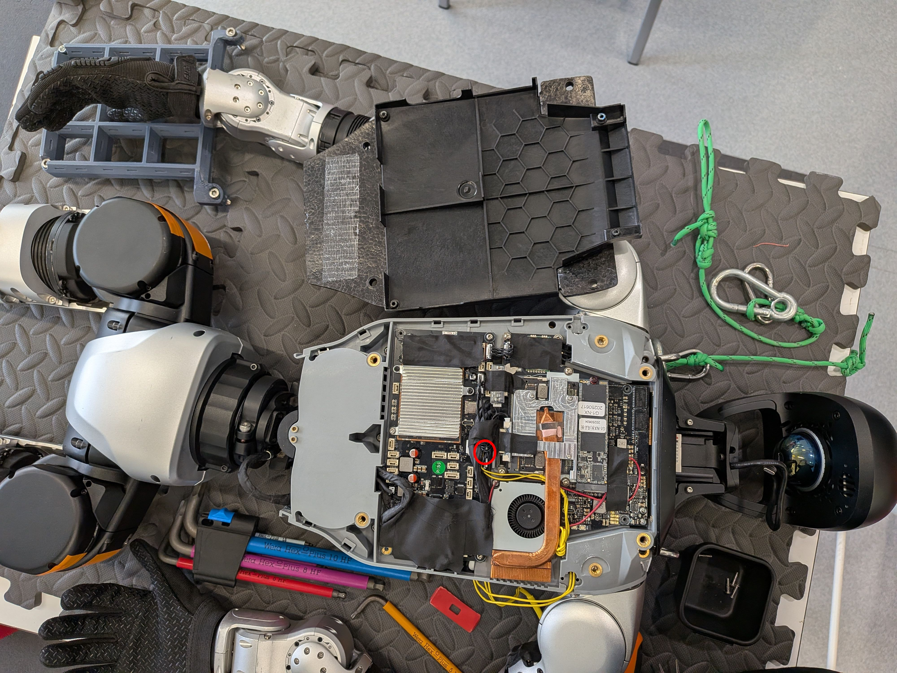
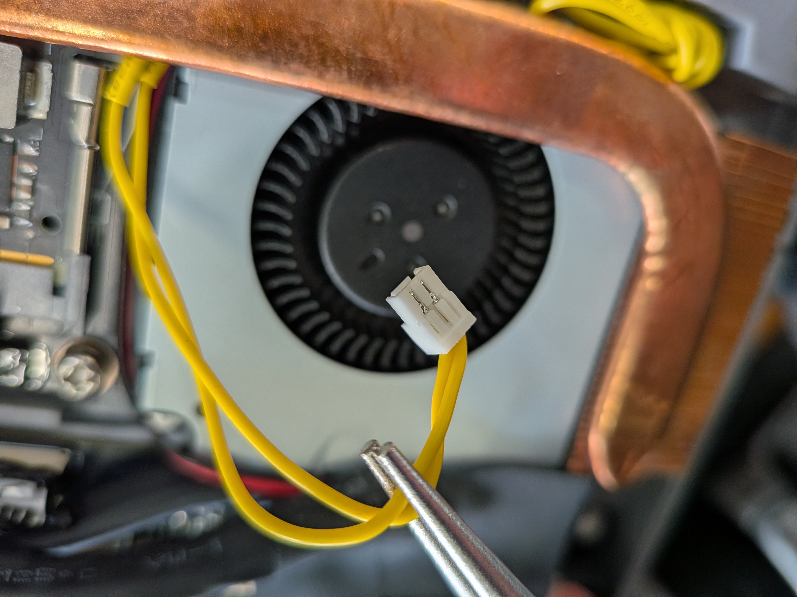
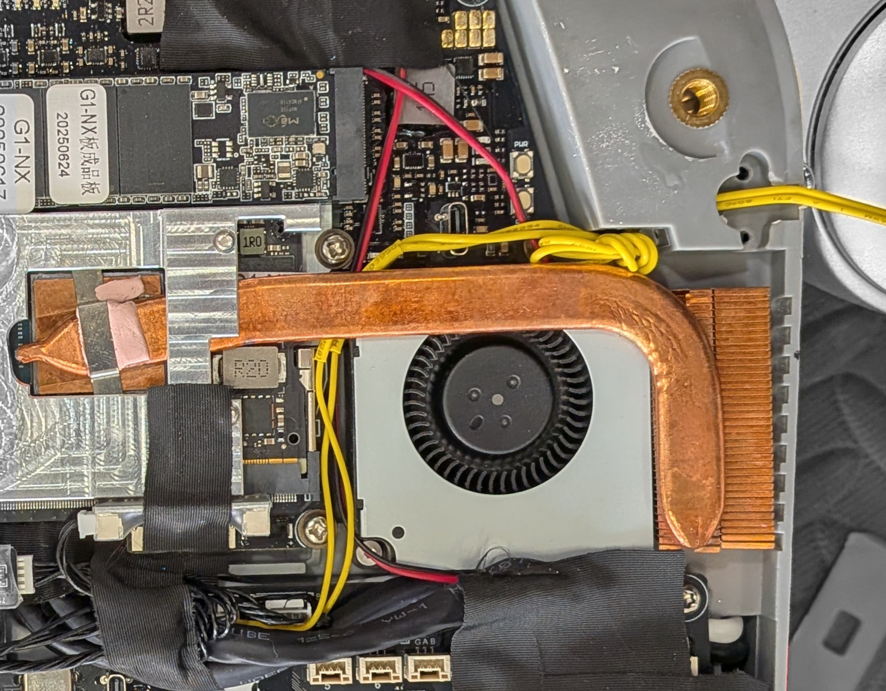
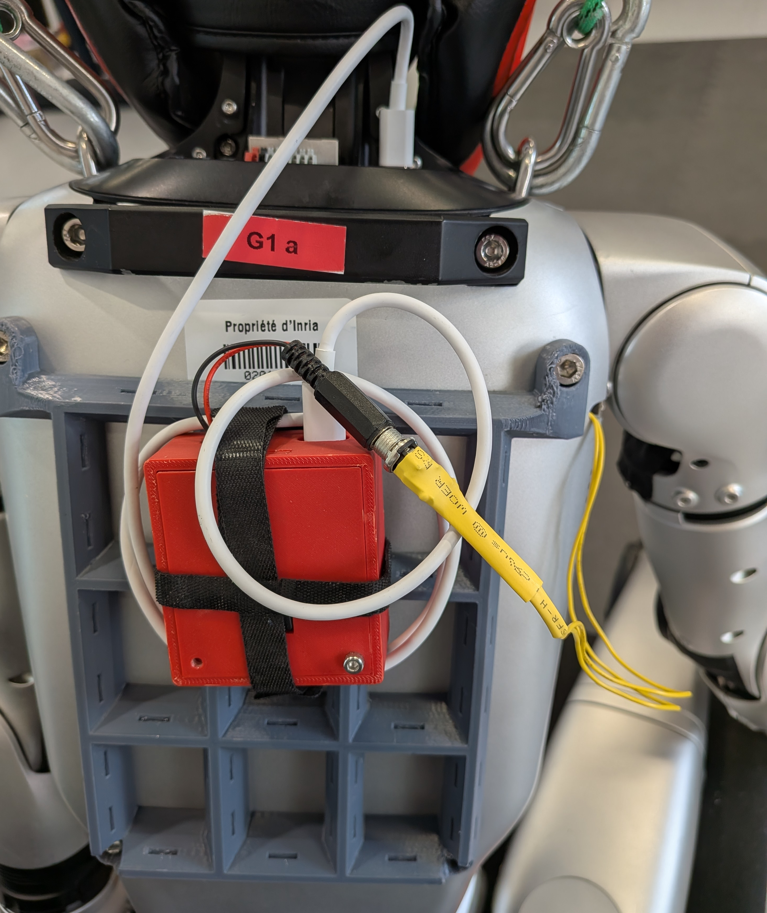

Wiring tutorial on Unitree G1
===
> [!IMPORTANT]
> Remove the battery from the robot before opening it.

Lay the robot on its front so that you can access the screws in the back.   
Unscrew the two screws of the handle.   

 

With a plastic card pop open the plastic outer shell. The clips that needs to be pushed are marked in red in the following pictures, be careful to also remove the one on top of the shoulder.   

<table>
    <td>
        

            
        

    </td>
        <td>
        

            
        

    </td>
</table>
 

Next to remove the polyester pannel unscrew the 4 screws marked in red and carefully pull. The bottom part of the pannel (where there are two velcro pads) is double taped, use a plastic card to carefuly unstick it and pull off the pannel entirely.  

 

The emergency stop plug is dead-center (in red).   

 

You will need to wire 2 wires to a GH 1.25 mm 2 pin male connector.  Keep the other end of the wires unsoldered so that you can thread them under the caloduc and through the vent to the outside the robot.
<table>
    <td>
        

            
        

    </td>
        <td>
        

            
        

    </td>
</table>
 

You can connect the other end of the wire (the part that will be outside of the robot) directly to the receiver module or to any connector of your liking.  
We use a female 5.5 x 2.1mm Power Jack connector plugged to a male connector of the same type soldered to the receiver :

    

The "backpack" can be found in our [CAD-parts repository](https://github.com/inria-paris-robotics-lab/CAD-parts/).
