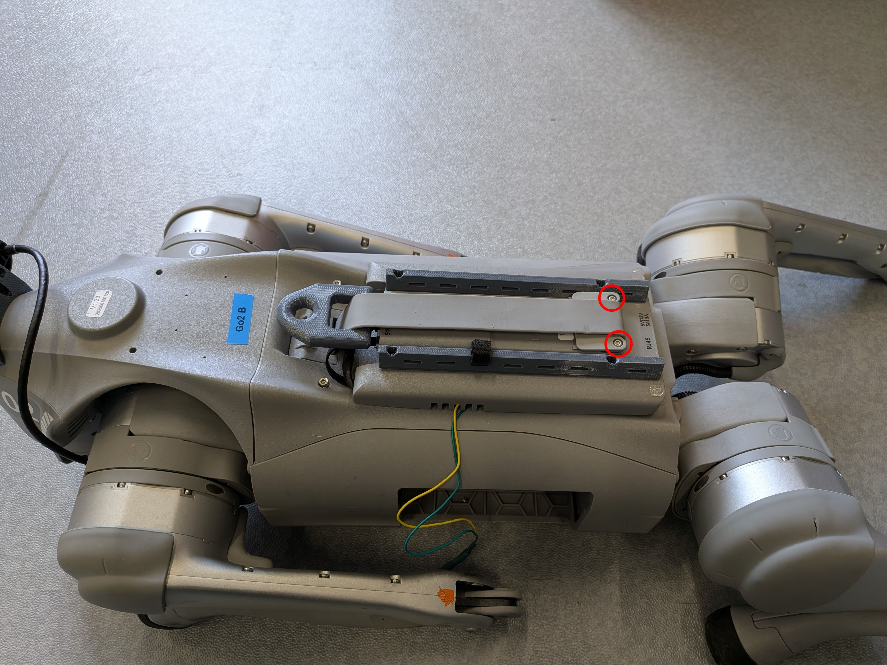
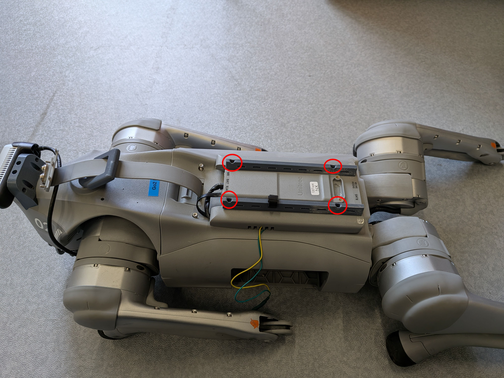
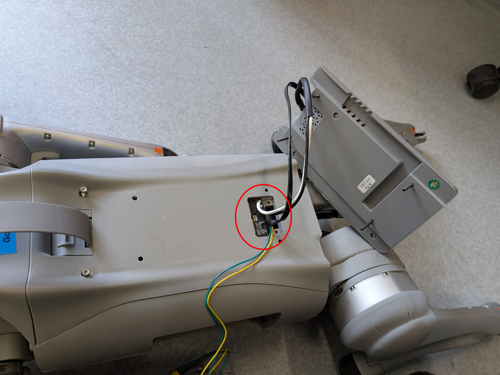
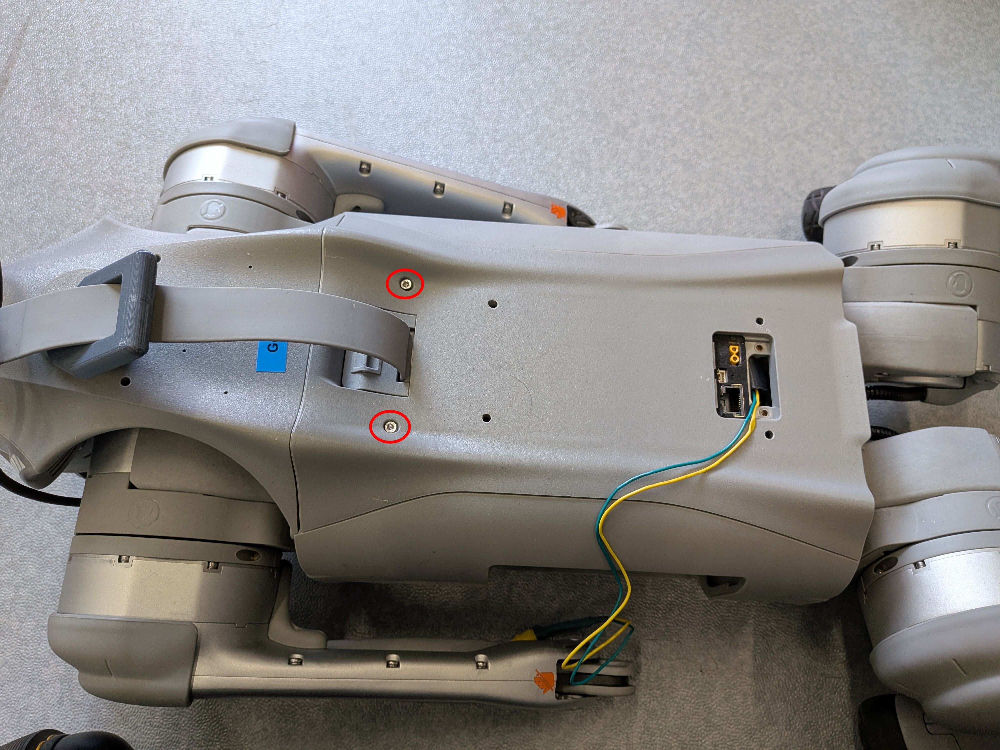
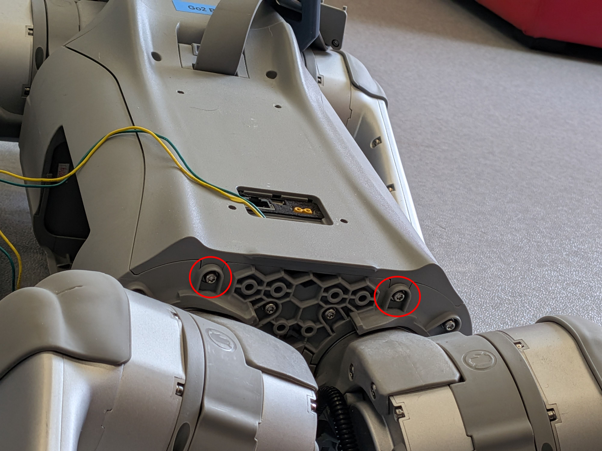
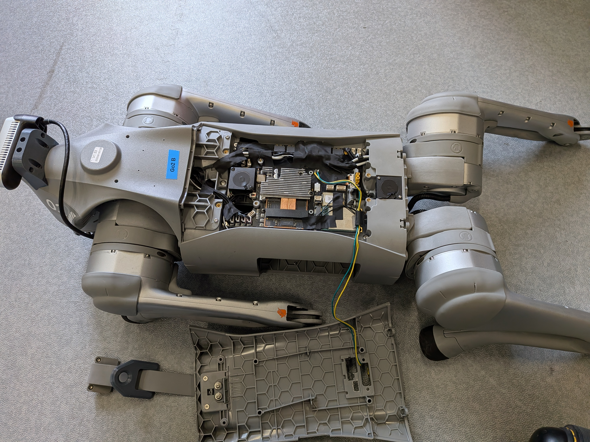
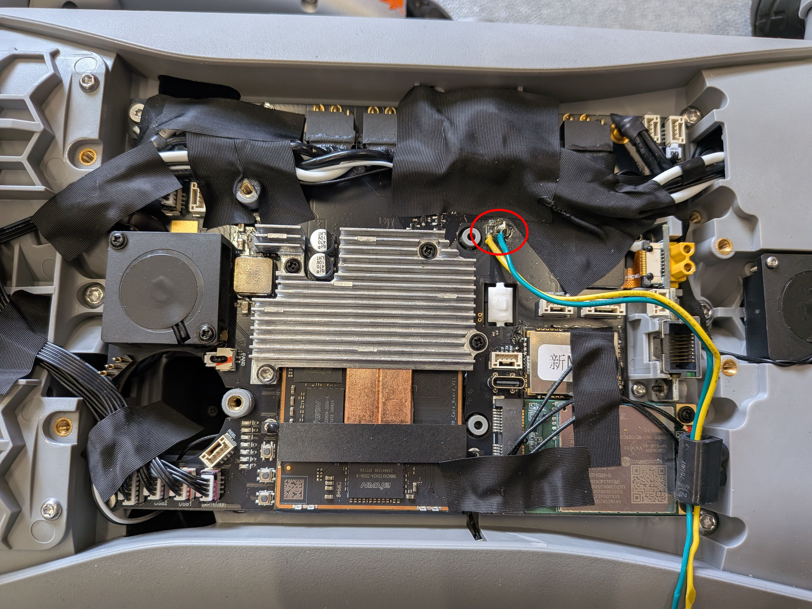

Wiring tutorial on Unitree Go2
===
> [!IMPORTANT]
> Remove the battery from the robot before opening it.

  
Unscrew the two screws of the handle.   

 

Remove the 4 screws that holds the Jetson.

 

Next, unplug the power and ethernet wire connecting the robot to the Jetson and put the Jetson aside.   

 

To remove the top plastic shell of the robot and access the mother board, remove 4 screws: two on the top and two on the back, near the legs actuators.    
<table>
    <td>
        

            
        

    </td>
        <td>
        

            
        

    </td>
</table>
 

Remove the cover.

 

Solder two wires directly to the mother board on the emegency pads (in red). And thread them through the hole in the top pannel that is used for the ethernet and the power for the Jetson.   

 

You can connect the other end of the wire (the part that will be outside of the robot) directly to the receiver module or to any connector of your liking.  
We use a female 5.5 x 2.1mm Power Jack connector plugged to a male connector of the same type soldered to the receiver.